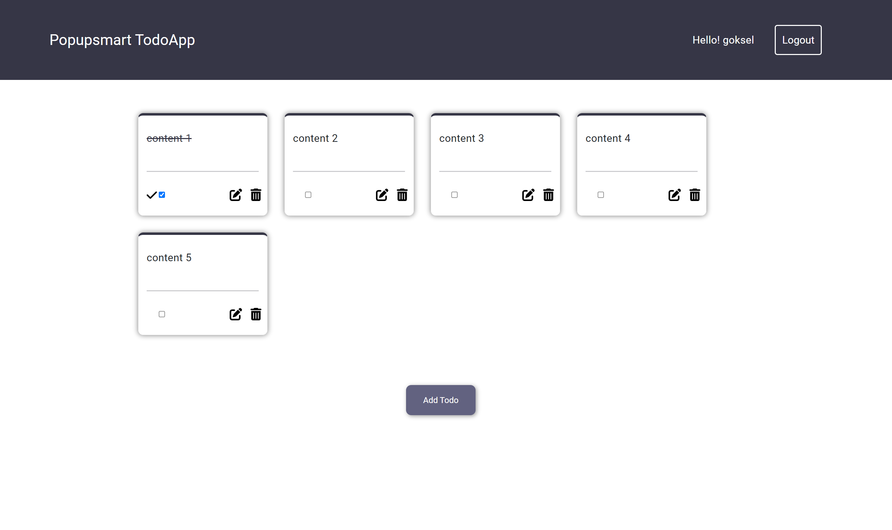
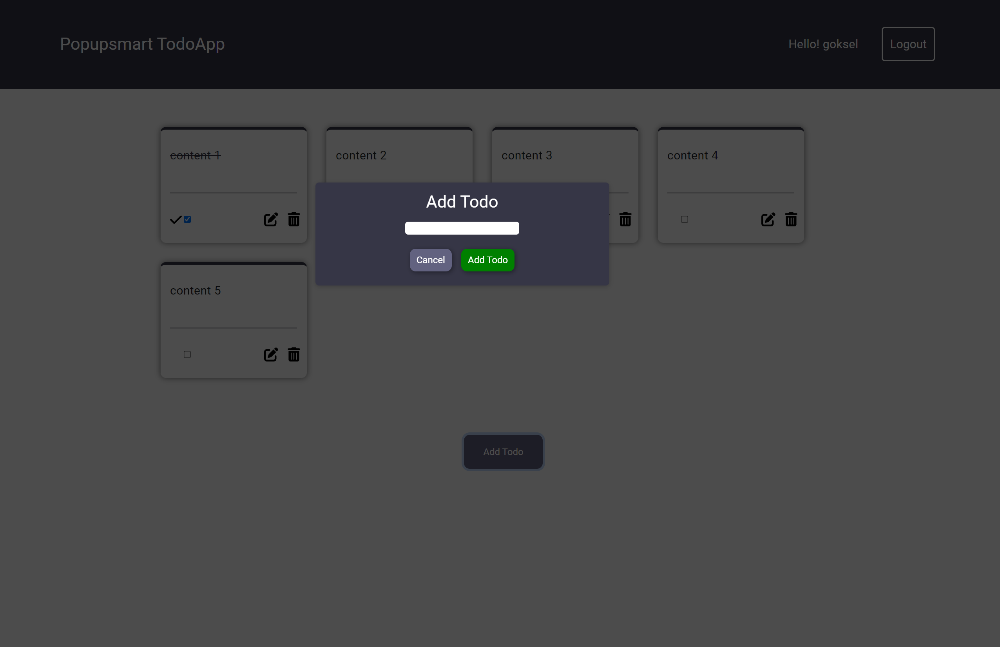

# Patika Popupsmart React Practicum TodoApp Project

This project was bootstrapped with [Create React App](https://github.com/facebook/create-react-app).

[Project WebSite](https://popupsmart-react-practicum.netlify.app/login)

### Libraries

- react-router-dom
- node-sass
- sass
- zustand
- bootstrap

 

### Context

Zustand context library used for general state event. All hooks and CRUD operations set in zustand stores.

### Summary

- User need to set username for login to dashboard
- User can add , edit , delete todos
- User can check todo status
- Website is responsive
- User can choose Dark/Light mode
- User need logout to delete username from localstorage
- All events depend CRUD operations

 

### ScreenShots

